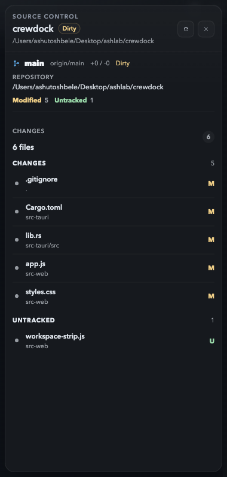
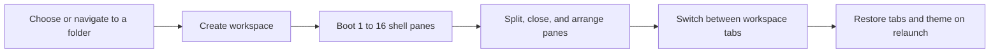
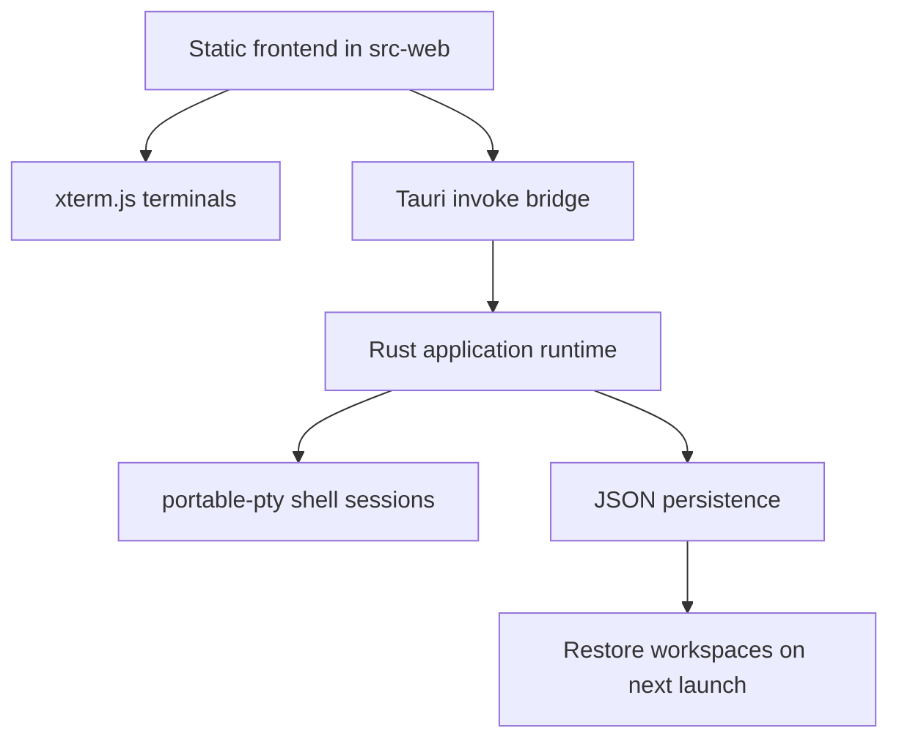

# CrewDock

<p align="center">
  A desktop workspace switcher for developers who want real shell sessions,
  fast tabbed context switching, and multi-pane terminal layouts without
  rebuilding their setup every time.
</p>

<p align="center">
  
</p>

<p align="center">
  
</p>

CrewDock is a Tauri app that binds each workspace tab to a real local project
folder, boots PTY-backed shell panes inside that workspace, and keeps Git
context close through a built-in source control drawer. It is built for the
moment when you are juggling multiple repos, multiple shell layouts, and
multiple contexts, but you still want everything to feel immediate.

## Why CrewDock

- Folder-backed workspace tabs instead of disposable terminal tabs
- Real shell sessions spawned by Rust with `portable-pty`
- Multi-pane grids powered by `xterm.js`
- Fast workspace switching without tearing down the current app-run sessions
- Quick switching, activity tracking, and attention badges across workspaces
- Built-in source control for changes, branches, commit history, and sync
- Built-in launcher commands with path completion for opening and navigating folders quickly
- Themeable desktop chrome plus adjustable interface and terminal sizing
- Local persistence for tabs, layouts, active workspace, theme, sizing, and AI settings

## Product Tour

<table>
  <tr>
    <td width="50%">
      
      <p><strong>Launcher</strong><br/>Start from a folder picker or use the command bar to navigate and open a workspace.</p>
    </td>
    <td width="50%">
      
      <p><strong>Workspace Builder</strong><br/>Choose how many terminals to boot up front, from a single shell to a dense grid.</p>
    </td>
  </tr>
  <tr>
    <td width="50%">
      
      <p><strong>Live Terminal Grid</strong><br/>Work inside real shell panes, split them directionally, and keep the layout tied to that workspace.</p>
    </td>
    <td width="50%">
      
      <p><strong>Theme Switcher</strong><br/>Swap the whole application chrome between built-in themes without losing workspace state.</p>
    </td>
  </tr>
</table>

<p align="center">
  
</p>

## Workflow



## Architecture



## Current Capabilities

- Top workspace strip with folder-backed tabs, rename actions, git state, and unread activity badges
- Inline workspace rename in the tab bar
- Workspace creation flow with launcher-based navigation, path completion, and 1 to 16 starting terminals
- Real directional pane splitting, pane maximize / restore, and pane close actions
- Per-pane shell input, resize wiring, and file-drop path insertion
- Source control drawer with staged / modified / untracked / conflicted sections, diff preview, commit entry, branch actions, and commit graph history
- Git actions for stage, unstage, discard, commit, commit-all, fetch, pull, push, publish, upstream wiring, and branch management
- AI-assisted commit message generation using a saved key or `OPENAI_API_KEY`
- Quick switcher and activity rail for moving between busy workspaces
- Settings for theme, interface text scale, terminal font size, and OpenAI API key storage
- Local persistence across app relaunches for workspaces, pane layouts, active workspace, settings, and recent activity context
- Six built-in themes

## Getting Started

### Prerequisites

- Node.js and npm
- Rust toolchain
- macOS system dependencies required by Tauri/WebKit

### Run locally

```sh
npm install
npm run check
npm run dev
```

`npm install` syncs the vendored `xterm.js` assets into `src-web/vendor`.
`npm run dev` then launches the native Tauri app.

## Using CrewDock

1. Launch the app.
2. Click `Open workspace` or use the launcher command bar.
3. Pick a folder and choose the starting terminal count.
4. Switch workspaces from the top strip as you move between repos.
5. Rename a workspace directly from the top bar when the default folder name is not enough.
6. Use the pane context menu or keyboard shortcuts to split, maximize, or close panes.
7. Open source control with the footer action or `Cmd/Ctrl+Shift+G` to review diffs, branches, and commit history.
8. Use `Cmd/Ctrl+K` to quick-switch workspaces and `Cmd/Ctrl+Shift+A` to review unread activity.
9. Open settings with the gear icon or `Cmd/Ctrl+,` to switch themes, adjust sizing, and manage the local OpenAI key used for AI commit messages.

## Launcher Commands

| Command | What it does |
| --- | --- |
| `help` | Show supported launcher commands |
| `pwd` | Print the current launcher base path |
| `ls` | List the current folder |
| `ls ../another-folder` | List a different folder without switching into it |
| `cd ..` | Move the launcher base path |
| `open .` | Create a workspace from the current launcher path |
| `clear` | Clear launcher output and command history from the current session |

`Tab` completion is supported in the launcher for path-aware commands such as
`ls`, `cd`, and `open`.

## Keyboard Shortcuts

| Shortcut | What it does |
| --- | --- |
| `Cmd/Ctrl+,` | Open settings |
| `Cmd/Ctrl+K` | Open the quick switcher |
| `Cmd/Ctrl+Shift+G` | Open source control for the active workspace |
| `Cmd/Ctrl+Shift+A` | Toggle the activity rail |
| `Tab` | Complete launcher paths |
| `Cmd/Ctrl+D` | Split the active pane to the right |
| `Cmd/Ctrl+Shift+D` | Split the active pane downward |
| `Cmd/Ctrl+Shift+Enter` | Maximize or restore the active pane |
| `Cmd/Ctrl+W` | Close the active pane |
| `Esc` | Dismiss overlays, drawers, and inline rename state |

## Source Control

CrewDock's source control drawer is deeper than a simple status badge. The
current implementation includes:

- Change lists grouped by staged, modified, untracked, and conflicted files
- Read-only diff previews for working tree and staged states
- Commit entry with `Commit`, `Commit All`, and AI-assisted message generation
- Branch search plus create, checkout, rename, delete, publish, and upstream actions
- Commit graph browsing with detail inspection, ref labels, and branch-from-commit actions
- Fetch, pull, and push controls that run through PTY-backed Git tasks

## Project Layout

```text
src-web/    Frontend UI, layout rendering, workspace strip, themes, xterm mounting
src-tauri/  Rust backend, PTY lifecycle, persistence, Tauri commands
```

## Developer Docs

If you are new to the codebase, start here:

- [`docs/developer-guide.md`](./docs/developer-guide.md) for architecture, state
  flow, persistence, PTY lifecycle, and the main places to edit when adding
  features
- [`docs/codex-plan.md`](./docs/codex-plan.md) for the current refactor and
  product direction notes

## Status

CrewDock is still early-stage, but the core interaction model is already in
place: open folder, create workspace, split panes, switch contexts, and come
back to the same setup later.

Current areas to push next:

1. Tighten PTY lifecycle handling when workspaces are closed or recreated rapidly.
2. Restore scrollback and session metadata more gracefully across relaunches.
3. Add workspace reordering and richer keyboard shortcuts.
4. Introduce higher-level agent orchestration once the terminal substrate is stable.

## Open Source

CrewDock is being shaped as an open source developer tool. Issues, design
feedback, and pull requests are all useful, especially around terminal UX,
workspace management, and persistence behavior.
