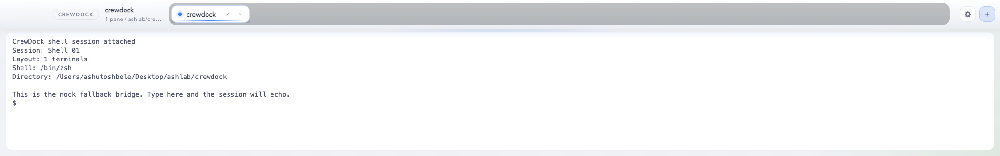
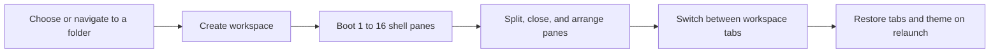
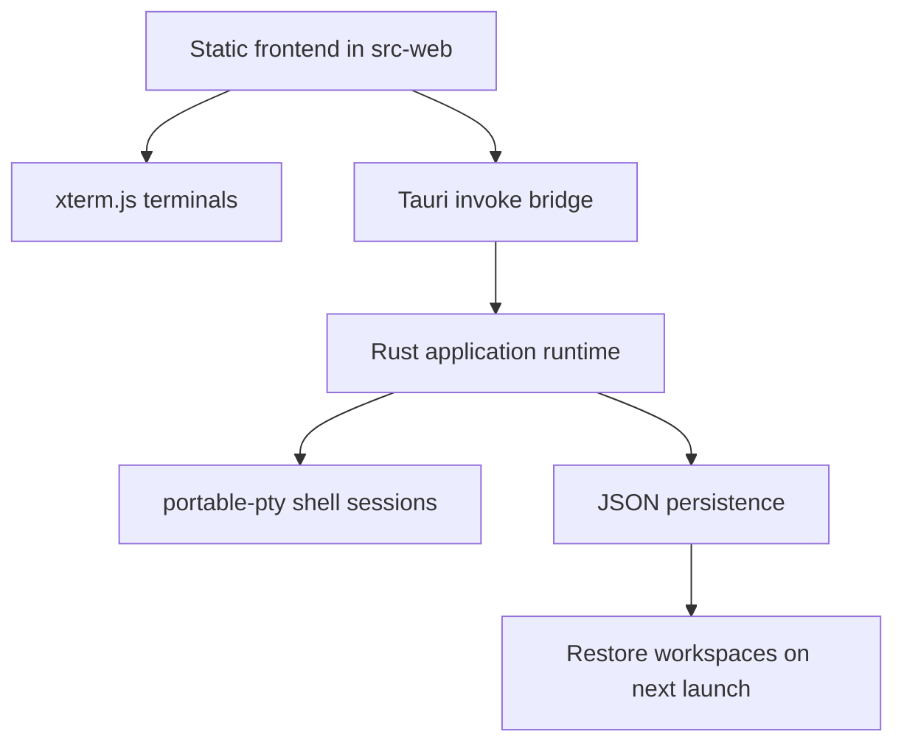

# CrewDock

<p align="center">
  A desktop workspace switcher for developers who want real shell sessions,
  fast tabbed context switching, and multi-pane terminal layouts without
  rebuilding their setup every time.
</p>

<p align="center">
  
</p>

<p align="center">
  
</p>

CrewDock is a Tauri app that binds each workspace tab to a real local project
folder and boots PTY-backed shell panes inside that workspace. It is built for
the moment when you are juggling multiple repos, multiple shell layouts, and
multiple contexts, but you still want everything to feel immediate.

## Why CrewDock

- Folder-backed workspace tabs instead of disposable terminal tabs
- Real shell sessions spawned by Rust with `portable-pty`
- Multi-pane grids powered by `xterm.js`
- Fast workspace switching without tearing down the current app-run sessions
- Built-in launcher commands for opening and navigating folders quickly
- Themeable desktop chrome with light and dark looks
- Local persistence for tabs, layouts, active workspace, and theme choice

## Product Tour

<table>
  <tr>
    <td width="50%">
      
      <p><strong>Launcher</strong><br/>Start from a folder picker or use the command bar to navigate and open a workspace.</p>
    </td>
    <td width="50%">
      
      <p><strong>Workspace Builder</strong><br/>Choose how many terminals to boot up front, from a single shell to a dense grid.</p>
    </td>
  </tr>
  <tr>
    <td width="50%">
      
      <p><strong>Live Terminal Grid</strong><br/>Work inside real shell panes, split them directionally, and keep the layout tied to that workspace.</p>
    </td>
    <td width="50%">
      
      <p><strong>Theme Switcher</strong><br/>Swap the whole application chrome between built-in themes without losing workspace state.</p>
    </td>
  </tr>
</table>

<p align="center">
  
</p>

## Workflow



## Architecture



## Current Capabilities

- Top workspace strip with folder-backed tabs
- Inline workspace rename in the tab bar
- Workspace creation flow with 1 to 16 starting terminals
- Real directional pane splitting
- Per-pane shell input and resize wiring
- Launcher commands for `help`, `pwd`, `ls`, `cd`, relative paths, absolute paths, `~`, and `open`
- Local persistence across app relaunches
- Six built-in themes

## Getting Started

### Prerequisites

- Node.js and npm
- Rust toolchain
- macOS system dependencies required by Tauri/WebKit

### Run locally

```sh
npm install
npm run check
npm run dev
```

`npm install` syncs the vendored `xterm.js` assets into `src-web/vendor`.
`npm run dev` then launches the native Tauri app.

## Using CrewDock

1. Launch the app.
2. Click `Open workspace` or use the launcher command bar.
3. Pick a folder and choose the starting terminal count.
4. Switch workspaces from the top strip as you move between repos.
5. Rename a workspace directly from the top bar when the default folder name is not enough.
6. Use the pane context menu to split right, split down, maximize, or close a pane.
7. Open settings with the gear icon or `Cmd+,` to switch themes.

## Launcher Commands

| Command | What it does |
| --- | --- |
| `help` | Show supported launcher commands |
| `pwd` | Print the current launcher base path |
| `ls` | List the current folder |
| `ls ../another-folder` | List a different folder without switching into it |
| `cd ..` | Move the launcher base path |
| `open .` | Create a workspace from the current launcher path |

## Project Layout

```text
src-web/    Frontend UI, layout rendering, workspace strip, themes, xterm mounting
src-tauri/  Rust backend, PTY lifecycle, persistence, Tauri commands
```

## Status

CrewDock is still early-stage, but the core interaction model is already in
place: open folder, create workspace, split panes, switch contexts, and come
back to the same setup later.

Current areas to push next:

1. Tighten PTY lifecycle handling when workspaces are closed or recreated rapidly.
2. Restore scrollback and session metadata more gracefully across relaunches.
3. Add workspace reordering and richer keyboard shortcuts.
4. Introduce higher-level agent orchestration once the terminal substrate is stable.

## Open Source

CrewDock is being shaped as an open source developer tool. Issues, design
feedback, and pull requests are all useful, especially around terminal UX,
workspace management, and persistence behavior.
