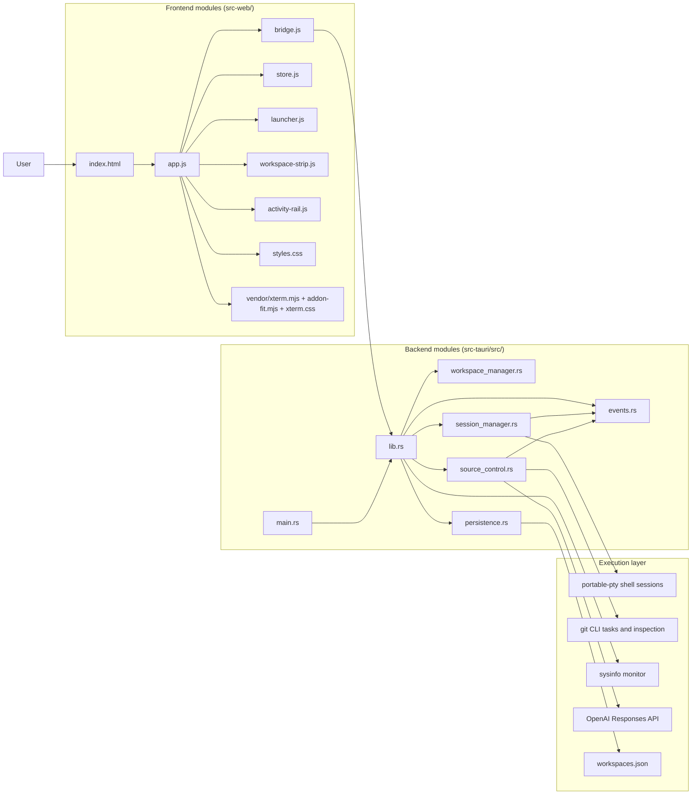
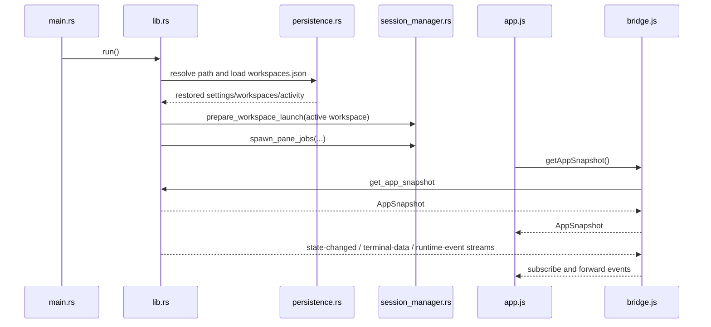
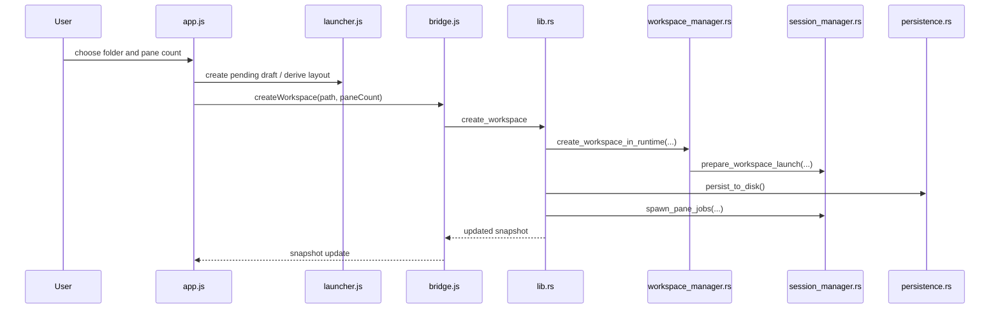
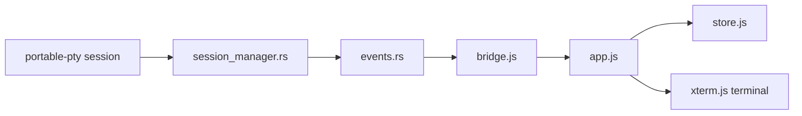
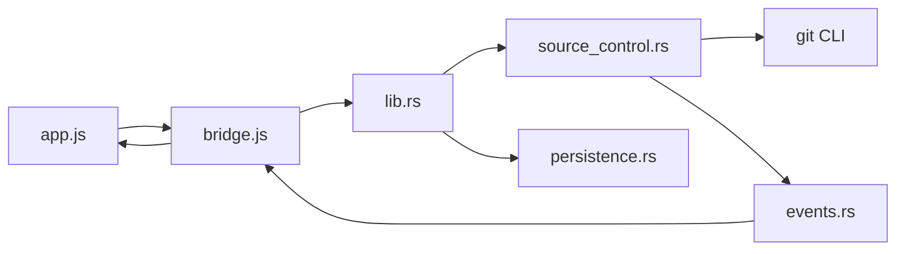
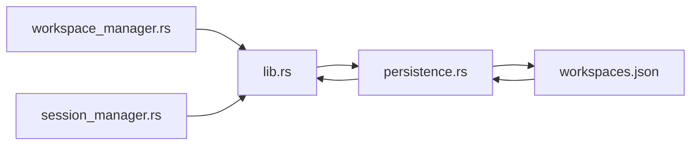

# CrewDock Module Architecture Reference

This document explains CrewDock in module terms: what each module owns, what
it depends on, and how modules cooperate at runtime.

Use this together with:

- `README.md` for product overview
- `docs/developer-guide.md` for onboarding
- `docs/crewdock-working-reference.md` for outer and internal behavior

## 1. Module Map

CrewDock is split into four layers:

1. Static frontend modules in `src-web/`
2. Tauri/Rust backend modules in `src-tauri/src/`
3. Runtime execution engines for PTY and Git work
4. Persistence and external integrations

## 2. Frontend Modules

### `src-web/index.html`

Role:
- Static app shell
- Loads `styles.css` and `app.js`
- Provides the DOM root the rest of the app mounts into

Works with:
- `styles.css` for all presentation
- `app.js` for the entire runtime

### `src-web/app.js`

Role:
- Main frontend orchestrator
- Bootstraps the app
- Owns event listeners, render scheduling, and DOM updates
- Mounts and disposes `xterm.js` terminals
- Wires user actions to `bridge.js`

Owns:
- App initialization
- Region-based rendering
- Event subscriptions
- Terminal lifecycle on the frontend
- UI interactions for launcher, workspace strip, source control, todos,
  activity, quick switcher, Codex modal, and system health

Depends on:
- `bridge.js` for backend commands and event streams
- `store.js` for view state and runtime object storage
- `launcher.js` for launcher and layout-picker helpers
- `workspace-strip.js` for workspace strip markup
- `activity-rail.js` for activity rail markup
- `xterm.mjs` and `addon-fit.mjs` for terminal rendering

Why it matters:
- This is the composition root of the frontend. Most frontend modules are
  helpers that are called by `app.js`, not peer runtimes.

### `src-web/bridge.js`

Role:
- Frontend-backend boundary
- Normalizes access to Tauri commands and event channels
- Provides a mock/browser implementation when Tauri APIs are unavailable

Owns:
- Command methods such as `createWorkspace`, `switchWorkspace`, `splitPane`,
  `runLauncherCommand`, `loadWorkspaceSourceControl`, and `writeToPane`
- Event subscriptions for:
  - `crewdock://state-changed`
  - `crewdock://terminal-data`
  - `crewdock://runtime-event`
- Dialog bridge for opening directories
- Mock runtime behavior for browser-only iteration

Works with:
- `app.js`, which never calls Tauri directly
- `lib.rs`, which owns the real command implementations

### `src-web/store.js`

Role:
- In-memory state factory for the frontend

Exports:
- `createUiState()`
- `createRuntimeStore()`

`uiState` owns:
- Current backend snapshot
- Overlay visibility
- Launcher input and history
- Source control panel state
- Todo panel state
- Activity rail state
- Quick switcher state
- Codex modal state
- Workspace rename and drag state

`runtimeStore` owns:
- Mounted `xterm.js` instances
- Buffered PTY output for remounts
- Cached workspace screens
- Timers, refresh loops, and render metrics

Works with:
- `app.js`, which reads and mutates both stores

### `src-web/launcher.js`

Role:
- Launcher-specific helpers and markup generation

Owns:
- Pane-count clamping
- Derived layout math from pane count
- Empty-state markup
- Workspace creation modal markup
- Launcher completion formatting

Works with:
- `app.js`, which uses these helpers for launcher and workspace creation flows
- `bridge.js`, indirectly, because launcher actions are executed via backend
  commands from `app.js`

### `src-web/workspace-strip.js`

Role:
- Workspace strip rendering helpers

Owns:
- Top strip markup
- Workspace tab labels
- Tab button markup
- Window summary markup
- Drag/drop indicator markup for tab reordering

Works with:
- `app.js`, which supplies data, behaviors, and event handling
- Backend workspace state indirectly through the current snapshot

### `src-web/activity-rail.js`

Role:
- Activity rail rendering helpers

Owns:
- Rail layout
- Workspace attention summary markup
- Activity item markup
- Relative-time presentation

Works with:
- `app.js`, which computes the rail data and owns the interactions

### `src-web/styles.css`

Role:
- Visual system for the entire application

Owns:
- Theme variable usage
- Layout rules
- Empty state visuals
- Strip chrome
- Modal surfaces
- Source control drawer styling
- Drag/reorder visuals
- Terminal container styling

Works with:
- `index.html` and markup emitted by `app.js` and helper modules

### `src-web/vendor/xterm.mjs`, `src-web/vendor/addon-fit.mjs`, and `src-web/vendor/xterm.css`

Role:
- Terminal rendering engine used by the frontend

Works with:
- `app.js`, which mounts terminals, writes PTY data, and fits terminals on
  resize

## 3. Backend Modules

### `src-tauri/src/main.rs`

Role:
- Thin native entrypoint

Works with:
- `lib.rs` by calling `run()`

### `src-tauri/src/lib.rs`

Role:
- Backend composition root
- Authoritative application state owner
- Tauri command surface

Owns:
- Module declarations
- `RuntimeState`
- Serializable snapshots exposed to the frontend
- Tauri command handlers
- Theme/settings helpers
- Launcher command execution
- Pane layout helpers
- Codex CLI discovery and session helpers
- System health loading
- Startup wiring in `run()`

Depends on:
- `workspace_manager.rs` for workspace mutations
- `session_manager.rs` for PTY launch and session handling
- `source_control.rs` for Git data and task orchestration
- `persistence.rs` for JSON restore/save logic
- `events.rs` for event emission

Why it matters:
- This is the backend hub. Almost every backend module either feeds into
  `lib.rs` or is called from it.

### `src-tauri/src/workspace_manager.rs`

Role:
- Workspace lifecycle mutation helpers

Owns:
- Building workspace records
- Workspace create, rename, reorder, switch, and close helpers
- Todo mutation helpers
- Pane split/close helpers tied to workspace state
- Workspace git refresh helper

Works with:
- `RuntimeState` from `lib.rs`
- `session_manager.rs` to prepare pane launch jobs
- `persistence.rs` indirectly through `runtime.persist_to_disk()`

Why it exists:
- Keeps workspace-specific mutation logic out of the already-large `lib.rs`

### `src-tauri/src/session_manager.rs`

Role:
- PTY session lifecycle manager

Owns:
- Preparing pane jobs for a workspace
- Spawning shell sessions via `portable-pty`
- Injecting shell environment variables
- Storing live PTY handles in `RuntimeState.sessions`
- Streaming terminal output
- Marking panes ready, closed, or failed
- Recording runtime activity for pane lifecycle events

Works with:
- `lib.rs` for runtime ownership
- `events.rs` to emit terminal bytes and runtime events
- `persistence.rs` to record recent activity
- `portable-pty` for actual shell execution

### `src-tauri/src/source_control.rs`

Role:
- Git inspection and Git task subsystem

Owns:
- Source control snapshot building
- Diff loading
- Commit detail loading
- Branch/remotes/graph loading
- Stage/unstage/discard helpers
- Long-running Git tasks through PTY-backed processes
- AI commit message prompt construction and API call

Works with:
- `lib.rs` for command routing and runtime ownership
- `events.rs` for task snapshot events
- Git CLI for repo inspection and mutation
- OpenAI Responses API for commit-message generation

### `src-tauri/src/persistence.rs`

Role:
- Durable JSON persistence layer

Owns:
- Persisted schema for settings, workspaces, todos, activity, and active
  workspace selection
- `workspaces.json` load/save helpers
- Persistence path resolution helpers
- Activity snapshot building and activity recording

Works with:
- `lib.rs` for save/restore orchestration
- `workspace_manager.rs` and `session_manager.rs` indirectly because they
  trigger persistence through runtime methods

### `src-tauri/src/events.rs`

Role:
- Backend event contract module

Owns:
- Event channel names
- Event payload structs
- Event emit helpers

Channels:
- `crewdock://state-changed`
- `crewdock://terminal-data`
- `crewdock://runtime-event`

Works with:
- `lib.rs`
- `session_manager.rs`
- `source_control.rs`
- `bridge.js`
- `app.js`

## 4. Module Responsibilities by Layer

| Layer | Main modules | Responsibility |
| --- | --- | --- |
| UI composition | `index.html`, `app.js`, `styles.css` | Mount app shell, orchestrate rendering, define look and feel |
| UI helpers | `launcher.js`, `workspace-strip.js`, `activity-rail.js` | Generate focused markup and helper logic |
| Frontend state/runtime | `store.js` | Hold view state and imperative frontend runtime objects |
| Frontend/backend boundary | `bridge.js` | Expose commands and events, plus mock fallback |
| Backend runtime | `lib.rs` | Own authoritative state and commands |
| Workspace domain | `workspace_manager.rs` | Workspace, pane layout, todo, reorder, and lifecycle mutations |
| Session domain | `session_manager.rs` | Spawn and manage PTY-backed shell sessions |
| Source control domain | `source_control.rs` | Git state, diffs, branches, tasks, AI commit generation |
| Persistence | `persistence.rs` | Save and restore JSON state |
| Event transport | `events.rs` | Snapshot, terminal-data, and runtime-event channels |

## 5. How Modules Work Together

### 5.1 Startup Path

What this means:
- `lib.rs` is the startup coordinator
- `persistence.rs` restores durable state
- `session_manager.rs` starts fresh PTY-backed shell sessions for the active
  workspace
- `app.js` initializes only after the backend is ready to provide a snapshot

### 5.2 Workspace Creation Path

What this means:
- Frontend modules decide how to present the create flow
- Backend modules decide what a workspace record looks like and when pane jobs
  should exist
- PTY spawning remains separate from the UI interaction itself

### 5.3 Terminal Data Path

Meaning:
- `session_manager.rs` reads bytes from the shell PTY
- `events.rs` emits them on `crewdock://terminal-data`
- `bridge.js` forwards the event to `app.js`
- `app.js` writes to the mounted terminal and also buffers the data in the
  runtime store for remount scenarios

### 5.4 Source Control Path

Meaning:
- The source control drawer is rendered in the frontend, but the data model is
  backend-owned
- Short Git actions return snapshots directly
- Long Git tasks stream progress through `runtime-event`

### 5.5 Persistence Path

Meaning:
- Most modules do not write files directly
- They mutate `RuntimeState`
- `RuntimeState` persistence methods delegate to `persistence.rs`
- `persistence.rs` is the only module that knows the durable JSON format

## 6. Key Interaction Contracts

### Frontend to Backend Contract

The frontend does not mutate backend state directly. It always goes through:

1. `app.js`
2. `bridge.js`
3. a Tauri command in `lib.rs`

This keeps the command surface explicit.

### Backend to Frontend Contract

The backend does not push arbitrary DOM instructions. It communicates through:

- full snapshots
- terminal byte events
- runtime events

This keeps rendering ownership in the frontend.

### Workspace Contract

Workspace state spans several modules:

- `workspace_manager.rs` owns structural mutations
- `session_manager.rs` owns live shell readiness
- `persistence.rs` owns durable storage
- `app.js` owns how the active workspace is rendered and interacted with

### Git Contract

Git state is backend-owned:

- `source_control.rs` computes it
- `lib.rs` exposes it
- `bridge.js` transports it
- `app.js` presents it

### Launcher Contract

Launcher behavior is split intentionally:

- `launcher.js` owns layout and helper logic
- `app.js` owns UI state and interactions
- `bridge.js` transports launcher commands
- `lib.rs` executes launcher commands and completion logic

## 7. Module Dependency Notes

Important asymmetries in the current design:

- `app.js` is intentionally the frontend hub and therefore depends on several
  smaller helper modules.
- `lib.rs` is intentionally the backend hub and therefore depends on most
  backend modules.
- Helper modules such as `launcher.js`, `workspace-strip.js`, and
  `activity-rail.js` do not directly call the backend.
- `persistence.rs` and `events.rs` are shared infrastructure modules used by
  multiple backend subsystems.
- `session_manager.rs` and `source_control.rs` are the two main runtime
  execution modules because they talk to external processes.

## 8. Read Order for Understanding Module Cooperation

If the goal is to understand how modules fit together, read in this order:

1. `src-web/app.js`
2. `src-web/bridge.js`
3. `src-web/store.js`
4. `src-web/launcher.js`
5. `src-web/workspace-strip.js`
6. `src-tauri/src/lib.rs`
7. `src-tauri/src/workspace_manager.rs`
8. `src-tauri/src/session_manager.rs`
9. `src-tauri/src/source_control.rs`
10. `src-tauri/src/persistence.rs`
11. `src-tauri/src/events.rs`

## 9. Summary

CrewDock is organized around two hubs:

- `src-web/app.js` on the frontend
- `src-tauri/src/lib.rs` on the backend

Everything else is there to keep those hubs from absorbing every concern.
Helper modules shape UI markup and local state. Domain modules handle
workspace, PTY, Git, persistence, and event concerns. The system works because
the boundaries are consistent:

- user actions flow inward through `bridge.js`
- backend state changes flow outward as snapshots and events
- PTY and Git execution stay backend-owned
- rendering and interaction stay frontend-owned
