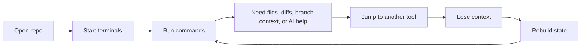
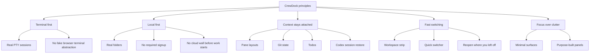
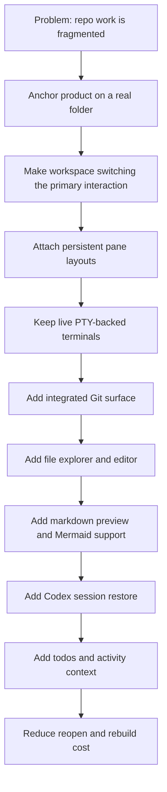
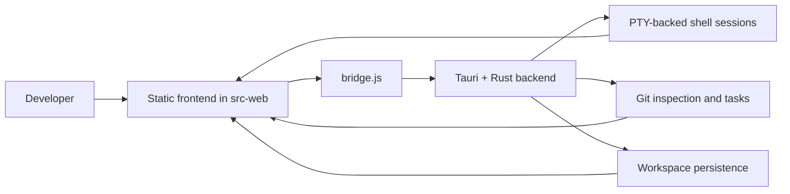

# Why We Built CrewDock

CrewDock started from a simple frustration: terminal-heavy development still
feels strangely fragmented on the desktop.

If you work across multiple repositories, multiple agents, and multiple shell
contexts, the operating system gives you windows and tabs, but not much real
working memory. You rebuild context all day. You reopen folders. You remember
which terminal belonged to which branch. You jump out to Finder, Cursor, Git
panels, and back again. The machine is fast, but the workflow leaks focus.

CrewDock is our answer to that problem.

It is not trying to replace the shell. It is not trying to become a browser
IDE. It is trying to give terminal-first developers a better home base:

- one folder becomes one live workspace
- one workspace keeps its own pane layout and context
- Git, files, todos, and Codex stay attached to that workspace
- switching repos feels like switching context, not rebuilding it

This post explains why we built CrewDock, how we shaped it, and what product
intent sits underneath the current feature set.

## The Core Problem

Most terminal workflows break down in the same loop:

That loop is normal enough that many developers stop questioning it. But once
you start using AI agents, long-running tasks, and parallel repo work, the
cost gets much higher.

The problem stops being "I have many terminals" and becomes:

- I cannot hold my execution context cleanly
- I keep re-deriving where work is happening
- side tools are detached from the terminal where the work actually lives
- switching projects costs too much attention

CrewDock exists to reduce that cost.

## The Product Intention

We wanted a product with a narrow opinion:

> A folder should become a persistent, live, terminal-first workspace.

That sounds small, but it has strong consequences.

If a folder is the anchor, then the rest of the product should align around
that anchor:

- pane layouts should persist with the workspace
- file navigation should stay rooted in that workspace
- Git should be scoped to that workspace
- Codex sessions should resume back into that workspace
- lightweight planning artifacts like todos should live there too

The intention was never "put more UI around terminals."

The intention was:

1. keep the shell real
2. keep the workspace local
3. keep context attached to the folder
4. reduce unnecessary switching

## The Design Principles

We kept returning to the same internal rules while building CrewDock.

Those principles explain many of the product choices that might otherwise look
unrelated.

For example:

- The launcher is intentionally path-oriented, not a general shell.
- The source control surface is embedded because Git is part of execution
  context, not a separate world.
- The file explorer and markdown preview exist because reading and editing
  nearby files should not force you out of the workspace.
- Codex session restore matters because AI work is now part of the same
  context loop as shell work.

## Why Terminal-First Still Matters

A lot of developer tooling tries to abstract away the terminal. We took the
opposite view.

The terminal is still where high-leverage work actually happens:

- starting and inspecting services
- running scripts and migrations
- checking logs
- managing branches and rebases
- invoking AI coding tools
- working across repositories without heavy project boot time

So CrewDock does not simulate terminal work. It uses real PTY-backed shell
sessions and builds around them.

That distinction matters because authenticity matters:

- commands behave like the user expects
- shell state persists naturally
- tools like `git`, `npm`, `pnpm`, `cargo`, `uv`, and `codex` behave normally
- the product feels additive, not restrictive

## Why Local-First Was Non-Negotiable

We did not want a product where the first step is account creation and the
second step is asking permission to touch your code.

CrewDock opens local folders and turns them into workspaces. That gives the
product a much cleaner trust model:

- the repo stays on your machine
- the shell stays on your machine
- work can begin immediately
- persistence is about restoring your setup, not owning your code

This also makes CrewDock useful for the exact kind of developer who lives in
many repos all day and does not want ceremony between intent and execution.

## How The Product Came Together

The build sequence was not "design everything, then implement."

It was closer to identifying friction points in the real workflow and then
locking them into the workspace model one by one.

That sequence is important because it shaped the product into something
coherent instead of feature-heavy.

The rule was always: if a feature does not strengthen workspace continuity, it
probably does not belong.

## How CrewDock Works Today

At a high level, the runtime is simple:

That architecture supports the main promise:

- the frontend renders the workspace
- the backend owns live shell and workspace state
- persistence restores the same working context on relaunch

The implementation detail matters less than the product result:

when you come back to a workspace, it should feel like your work is still
there, not like the app is asking you to reconstruct it.

## What Makes CrewDock Different

There are many tools around terminals. What we cared about was the combination
of constraints.

CrewDock is specifically trying to be:

- terminal-first, not terminal-adjacent
- workspace-oriented, not tab-chaotic
- local-first, not cloud-gated
- lightweight in interaction, not overloaded with chrome
- opinionated about context continuity

That is why the product includes things that belong close to execution:

- workspace tabs tied to real folders
- persistent pane layouts
- integrated Git flow
- explorer and lightweight editor
- markdown preview with Mermaid diagrams
- Codex session restore into real panes
- activity and todo context attached to the workspace

Individually, none of those ideas are novel.

Together, they create a different feeling: the workspace starts to act like a
stable dock for active engineering work.

## The Real Intention Behind CrewDock

The deeper intention is not "better terminals."

It is reducing the cognitive tax of modern development.

Today, developers are juggling:

- more repositories
- more parallel work
- more background processes
- more AI-assisted coding loops
- more context switches per hour

The default desktop model has not really adapted to that.

CrewDock is our attempt to build a better default:

- keep a repo anchored
- keep the shell alive
- keep the surrounding context nearby
- make switching cheap
- make returning instant

If we do that well, the product disappears in the right way. It stops feeling
like a tool you manage and starts feeling like a place you work from.

## Where We Want To Push It

The long-term direction is still governed by the same question:

Does this make a workspace feel more continuous, more trustworthy, and easier
to re-enter?

That means future work should continue to strengthen:

- persistence of working context
- fast project switching
- better terminal ergonomics
- better AI session continuity
- clearer workspace-level visibility into tasks and changes

The point is not to build everything.

The point is to build the missing home base for terminal-first development.

## Closing

CrewDock came from a very practical observation:

developers do not just need terminals. They need stable context.

A folder, a few real panes, attached Git state, fast file access, markdown
preview, and resumable AI sessions go a long way when they all stay bound to
the same workspace.

That is the intention behind CrewDock.

Not more surface area.

Less friction between deciding what to do and actually doing it.
